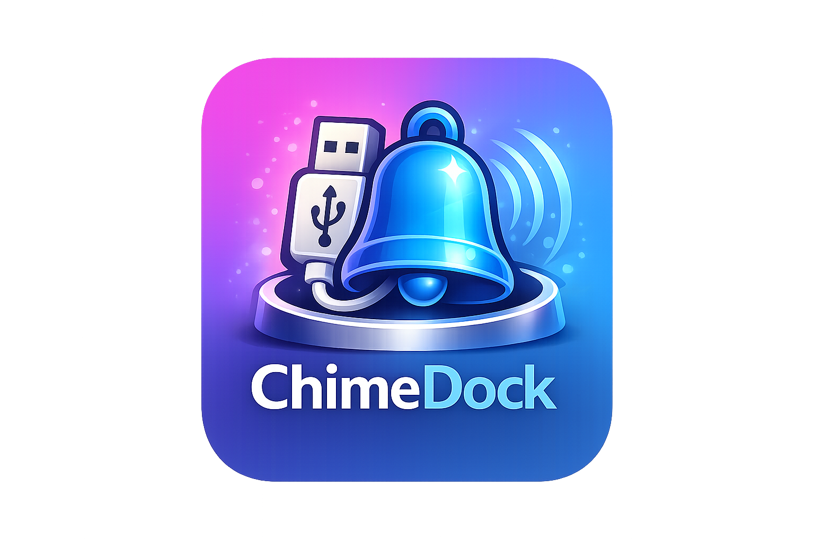

# ChimeDock

<p align="center">
  
</p>

<p align="center">
  <a href="https://github.com/ragnarok22/ChimeDock/actions/workflows/test.yml"></a>
  
  
  <a href="https://github.com/ragnarok22/ChimeDock/releases"></a>
  <a href="https://github.com/ragnarok22/ChimeDock"></a>
</p>

A macOS menu bar app that plays a chime when USB devices are connected or disconnected.

## Features

- Plays configurable sounds on USB connect and disconnect events
- Includes bundled custom sounds and supports built-in macOS system sounds
- Per-event sound selection (different sounds for connect vs disconnect)
- Adjustable volume
- Launch at login
- Quick-toggle and sound test from the menu bar

## Installation

### Homebrew (recommended)

```bash
brew tap ragnarok22/chimedock
brew install --cask chimedock
```

### Manual

Download the latest `.dmg` from the [Releases](https://github.com/ragnarok22/ChimeDock/releases) page, open it, and drag **ChimeDock.app** to your Applications folder.

## Requirements

- macOS 26.2+
- Xcode (Swift 5) — only needed for building from source

## Building from Source

Open `ChimeDock.xcodeproj` in Xcode and build, or from the command line:

```bash
xcodebuild -scheme ChimeDock -configuration Debug build
```

## Running Tests

```bash
xcodebuild test -scheme ChimeDock -destination 'platform=macOS'
```

## Sound Options

| Sound | Source |
|-------|--------|
| Yamete Intro / Outro | Bundled MP3 (`Resources/Sounds/`) |
| Ping, Glass, Pop, Hero, Purr, Tink, Basso, Funk | macOS system sounds |
| None | Silent |
